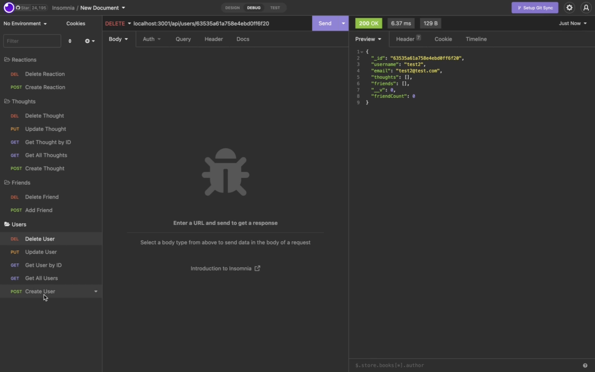

# Social Network

## Table of Contents
- [Project Description](#project-description)
- [Installation Instructions](#installation-instructions)
- [Usage Information](#usage-information)
- [Questions?](#questions)

## Project Description
This project was created to demonstrate the usability and understanding of the database MongoDB and the package Mongoose.

## Installation Instructions
Open the command line, type "npm start", press enter.
Head to insomnia to make all of the requests
Link for the instructional video: [Video](https://drive.google.com/file/d/1kd-BrunDOuH-4_kQBhpyp6bGMs10DxXJ/view)

## Usage Information
Using insomnia, you can make call to get the following:
- Create user, get all users, get user by id, update user and delete user.
- Add and delete friend to user.
- Create thought, get all thoughts, get thought by id, update and delete thought.
- Create and delete reactions.

## Questions?
Here is my GitHub Profile: [pargasparedes](https://github.com/pargasparedes)

### Here are some screenshots of the application:

#### Create Friend

#### Get Thought by ID

#### Delete User

#### Update Thought

